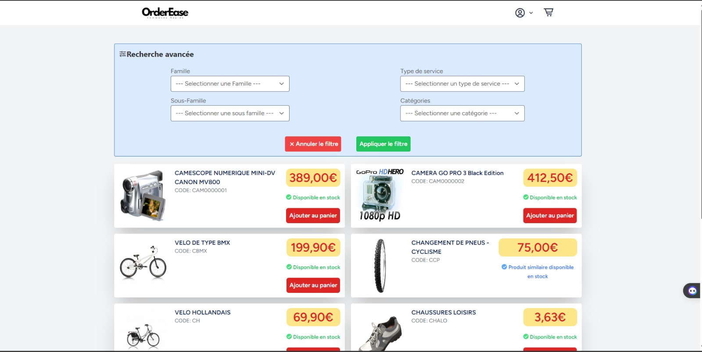

## About Order Ease

OrderEase is a web-based quick order application where users can :
- Connect to the platform
- Visit the list of products
- Add a product to the basket and place an order
- An administrator can add new users
- Validate orders

## Starting the project

### Requirements
- php >= 8.1
- sql server 

### Build 
- `composer install`
- `npm install && npm run dev`
- `php artisan migrate`
- `php artisan serve`

## Images

